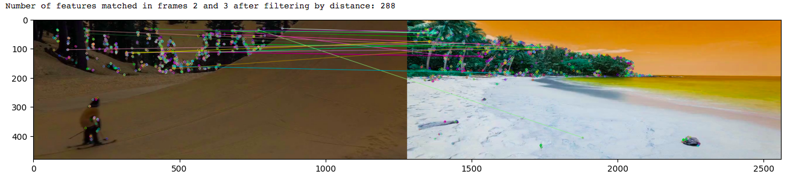

# Automated Video editing pipeline
Author: Leelendhu Mouli Kothapalli

For running the python script, download the repository and run 

$ python video_sort.py "shuffled_19.mp4"

You will need openCV library and numpy library to run this code, you can install them using

$ pip install opencv-python

$ pip install numpy

Or you can use the google colab notebook Video_sort.ipynb which has pre installed libraries

For building a docker image, download the repository and run

$ docker build -t videosort .

For running the docker image, after building it like above, run

$ cd DockerComposeFile

$ docker compose -up

You can check if the docker image is running using

$ docker ps

## 1 Problem Statement

As a part of the technical test, an Algorithm challenge was given. A corrupted video where all images

have been shuffled and mixed with images not belonging to the initial sequence was given and the

challenge was to remove the outlier frames and reorder the sequence. The shuffled video can be accessed

#### [here](https://drive.google.com/file/d/1hkViQuFmQs-3QtLOLY6KQZJXk6g4SijC/view)

## 2 Analysis

 A video is nothing but a sequence of frames. Each frame is an image in itself. And each image can be

 represented as an RGB matrix, meaning that it is a 3 channel matrix of RGB values. Basically we have

 the RGB intensity of each pixel of the image stored in the image matrix. We can find the similarity

 between two images in numerous ways. Some of them are listed below:

- **Distance function**: Since images are matrices, we can find the distance between two matrices in

  different ways. We can find the sum of absolute difference between each pair of corresponding pixels

  which would be the L1 norm distance. We can find the sum of squares of difference between each

  pair of corresponding pixels which would be the L2 norm, and by averaging it we can get Mean

  Square Error (MSE) distance. Note that all these would work well only if both images have the

  same scale. Structural Similarity Index, developed by Wang et al [1] is another method that

  overcomes the issues associated with MSE. There are many other such distance functions which

  can be used.

- **Feature matching**: Features may be specific structures in the image such as points, edges or objects

  which provide us a piece of information about the content of an image; typically about whether

  a certain region of the image has certain properties. Every feature has a pixel coordinate and

  a feature descriptor which describes the neighbourhood of the pixel. There are different feature

  detectors available like ORB, SURF, SIFT, BRIEF etc. We can match features from two images

  based on different algorithms like brute force matcher or nearest neighbours match (FLANN).

  Based on the number and quality of matches we can decide the similarity between two images

- **Siamese networks** : We can also train deep neural networks to identify the distance between two

  images. We can train this network such that the distance is large between two dissimilar images and

  the distance is small between two similar images. We have to ensure correct selection of training

  data, such that the dissimilar images have some common patterns and the similar images are not

  very close to each other to ensure good results.

## 2.1 Choice of Solution

To solve this challenge, a distance function is enough since subsequent images in a video will have a lot

of similarity. While feature matching would be an overkill, it could also mislead us in case there are

some common features between the outlier frames and the actual video frames. Similarly deep neural

networks would not only be an overkill but would also require training dataset to ensure good results.

A distance function with L1 norm is chosen as it computationally less expensive than L2 norm or MSE.

We will compare the results at the end with different distance functions.


## 3 Solution

The solution proposed is based on Python and uses the openCV and Numpy libraries. The code is

attached with document and also can be found [here](https://github.com/leelendhu/Video_editing/blob/main/Meero_L1.ipynb) .
A google colab notebook has also been created

and can be accessed [here](https://github.com/leelendhu/Video_editing/blob/main/Meero_L1.ipynb). 
The solution is divided into five steps, each step being a function in itself.

### 3.1) Frames from video

The first step in our solution is to divide the given shuffled video into frames and store each frame as

an image matrix in an array called frame array. It is quite straightforward using the openCV video read

function. We calculate the number of frames, store the frames in order in the array and return this frame

array

#### Frames from video: 
```
def frames_from_video(video_path):
   '''An array of the frames from given video is returned 
    and the frames are saved''' 
   vid=cv2.VideoCapture(video_path)
   i=0
   frame_array = []
   while(vid.isOpened()):
      ret, frame = vid.read()
      if ret == False:
          break
      frame_array.append(frame)
      i+=1
   number_of_frames  = i
   vid.release()
   return frame_array 
```

### 3.2) Average L1 norm

Now we will create an array called averageL1. This array contains the average L1 norm between the

image and its 5 closest neighbours. The idea behind this operation is that the L1 norm between two very

similar images would be very low and between two vastly different images would be very high. Since in a

video, consequent frames will mostly have very similar images, their L1 norms with their neighbours will

be low. While the outlier frames will have high L1 norms with any other image. By finding the average

L1 norm between the image and its 5 closest neighbours, we can easily detect the outlier frames.

#### Average L1 norm: 

```
def average_L1(frame_array):
    '''An array containing the average L1 norm of 5 nearest 
    neighbours for each image is returned'''
    averageL1 = list([])
    for i in frame_array:
        L1values = list([])
        for j in frame_array:
            L1 = cv2.norm( i, j, cv2.NORM_L1); 
            L1values.append(L1)
        L1values = np.sort(L1values)
        avg = sum(L1values[1:5])/5
        averageL1.append(avg)
    return averageL1
```
### 3.3) Removing Outliers

We will remove the outlier frames based on the average L1 value obtained above. There will be a big gap

between the average L1 value of actual video frames and outlier frames. So we can sort our averageL

array in ascending order calculate the biggest jump and use that as the distinction between outlier frames

and wanted images, i.e the ones to the right of the biggest jump would be outlier frames and the ones to

the left of the biggest jump would be our video frames. We can then use that threshold value to remove

the outlier frames. Let us call the new array without any outlier frames as correctedarray

#### Removing Outliers: 

```
def remove_outliers(averageL1, frame_array):
    '''Sorts the input array in ascending order and finds the biggest jump 
    between two consecutive values and removes all elements to the right of this 
    biggest jump'''
    averageL1sort = np.sort(averageL1)
    biggestjump = 0
    index_of_biggestjump = 0
    for i in range(len(averageL1sort) - 1):
        jump = averageL1sort[i+1] - averageL1sort[i]
        if jump > biggestjump:
            biggestjump = jump
            index_of_biggestjump = i

    corrected_list = list([])
    threshold = averageL1sort[index_of_biggestjump]
    for i in range(len(averageL1sort)):
        if averageL1[i]<=threshold:
            corrected_list.append(i)      

    corrected_array = []
    for i in corrected_list:
        frame = frame_array[i]
        corrected_array.append(frame)

    return corrected_array
```
### 3.4) Sorting the Corrected Array

We sort the corrected array based on the L1 values. We take the initial frame and find its L1 values

with respect to all other images in the corrected array. The image which corresponds to the lowest L

value will be our second frame. Again we find the corresponding image which will have the lowest L

value from the remaining images. We will do this until all the frames are sorted in order and return this

sorted array.

#### Sorting the corrected array: 

```
def sort_L1(array):
  '''Sorts an image array taking the first element as pivot and finding
  the closest L1 neighbour for it and repeating the same '''
  i = 0
  sorted = []
  sorted.append(array[i])
  array.pop(i)

  while len(array) > 1:
    nf = Inf
    ind1 = 0
    for j in range(len(array)):
      img1 = sorted[i]
      img2 = array[j]
      d = cv2.norm(img1, img2, cv2.NORM_L1)
      if d < nf:
        nf = d
        ind1 = j
    sorted.append(array[ind1])
    array.pop(ind1)
    i = i+1
  sorted.append(array[0])
  return sorted
```

### 3.5) Stitching images into Video

This is the opposite step of our first step,where in we stitch the different images in the given image array

into a video and save it in the given destination. We can do this using the openCV video writer function.

#### Stitching images into video: 

```
def stitch_video(sorted_array, vid_output):
    '''Stores a mp4 file at the give path stitched from the 
    images in input array'''
    img=[]
    for i in sorted_array:
        img.append(i)
    height,width,layers=img[0].shape
    video_fin=cv2.VideoWriter(vid_output,cv2.VideoWriter_fourcc('m', 'p', '4', 'v'),15,(width,height))
    for j in range(len(sorted_array)):
        video_fin.write(img[j])
    cv2.destroyAllWindows()
    video_fin.release()
```
### 3.6) Unjumbled Video

On performing the above functions on the shuffled video we get the unjumbled video which can be

accessed [here](https://drive.google.com/file/d/11JDP9zyCrllrJEZXGBvlJmLqDXp1EMSG/view?usp=sharing)

Clearly this video is very smooth and completely reversed. Since the first frame of the sorted array was

actually the last frame of the original video, we get a reversed video. What is interesting to note is that

the algorithm doesn’t have any context or knowledge about what is going on in the video. It just corrects

it based on taking the first frame and finding its nearest neighbour from the remaining frames and so

on. In case we start with the first frame of the original video as the initial frame in our corrected array,

then we will get a forward video.

## 4 Challenges and future work

### 4.1) Time complexity

Clearly using different distance measures results in different time complexities. Using a L1 norm means

just taking the absolute difference , while using the L2 norm or MSE would mean squaring this difference

thus resulting in larger computational time. A table is presented based on the computation times found

for different distance measures.
#### Table 1: Distance measure vs computation time
Distance Measure | Time taken |
--- | --- | 
L1 norm | 23 seconds | 
L2 norm | 183 seconds | 
MSE | 370 seconds | 

### 4.2) Feature Matching

Feature matching was also used to  remove outliers but it was observed that it is not a very effective method. 

The main problem observed was that there could be outlier frames with similar features to original frames of

the video. To ensure that does not happen, we will need to train the algortihm to only track particular set of 

features or avoid certain features. But this would mean having a training set and some prior information about 

the video and outliers. Clearly in Figure 1, we see that ORB features are matched between trees found in an 

outlier frame and the actual video frame. 





## References
[1]  Wang Z.,  Bovik A. C.,  Sheikh H. R.,  and Simoncelli E. P.  Image quality assessment:  From errorvisibility to structural similarity.IEEE Transactions on Image Processing, 13(4), 600–612., 2004

